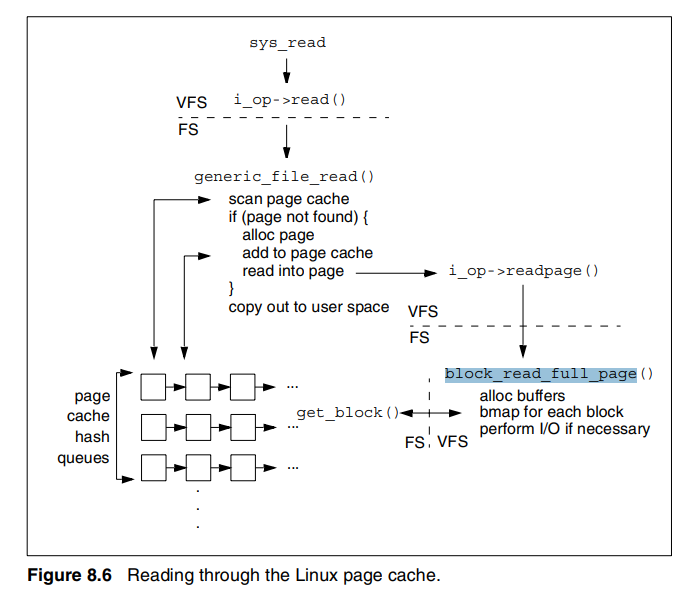
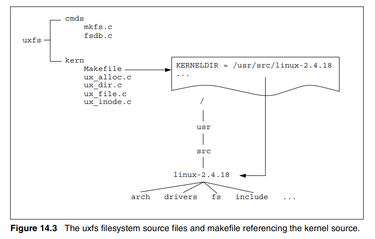
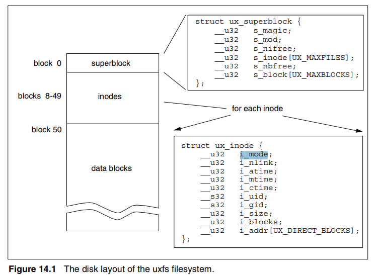
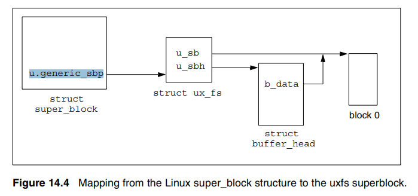

# UNIX Filesystems (교재)
## File I/O in the 2.4 Linux Kernel
    page cache를 이용한 regular file의 read, write를 살펴보자.

### Reading through the Linux Page Cache

    user가 read
    => system call인 sys_read() 호출
    => Uxfs-specific read function인 generic_file_read() 호출
    => page cache에서 읽을 page를 찾는 do_generic_file_read() 호출
    => do_generic_file_read() : page cache에서 page를 찾는 loop 수행

        (1) __find_page_nolock : page cache에 page가 있는지 확인 
            - 있다 : found_page로
            - 없다 : no_cached_page로

        (2) found_page : page를 받고, 최신 page인지 확인
            - 최신 page다 : generic_file_readahead(미리 읽고) page_ok로
            - 최신 page가 아니다 : page_not_up_to_date로

        (3) page_ok : page를 user space buffer로 복사하고, loop 종료

        (4) page_not_up_to_date : generic_file_readahead(미리 읽고) page_ok로

        (5) no_cached_page : page_cache_alloc(새로운 page 할당하고), 
            __add_to_page_cache(page cache에 새로운 page 추가하고), readpage로

        (6) readpage : readpage(disk에서 page 읽고), 최신 page이면 page_ok로

    => readpage() 호출하면 ux_readpage() 호출 - block_read_full_page() 호출
    => block_read_full_page() 
        - create_empty_buffers()
        - ux_get_block()
        - submit_bh() : 할당한 buffer head들을 block device에 제출
    => submit_bh() 내에서 generic_make_request() 호출
    => generic_make_request() : device driver에게 buffer 전달
        

### Writing through the Linux Page Cache

    user가 write
    => system call인 sys_write() 호출
    => Uxfs-specific write function인 generic_file_write() 호출
    => generic_file_write() 

        (1) __grab_cache_page() : write할 page 찾기

        (2) prepare_write() : ux_prepare_write() - block_prepare_write() - __block_prepare_write() 호출 
            - create_empty_buffers()
            - ux_get_block() - ux_block_alloc()

        (3) __copy_from_user() : user space에서 kernel space로 data copy

        (4) commit_write() : generic_commit_write() - __block_commit_write() 호출
            - __mark_dirty()

        (5) generic_osync_inode()

## File I/O in uxfs

    block_read_full_page() 내에서 ux_get_block() 호출

 
> int ux_get_block(struct inode *inode, long block,
>    struct buffer_head *bh_result, int create)

    - 캐싱 안 된 부분에 접근할 때마다 호출
    - block : file내 logical block. (eg) block 0 == file offset 0
    - create
        - 0이면 read
        - 1이면 새로운 data block 할당 (ux_block_alloc() 호출) 
  

# 기타 함수 정리
## generic_file_readahead

    - FS에서 file을 읽기전에 미리 몇 page를 읽어서 성능을 최적화하는 역할
    - Read-ahead contex 정리
        - f_raend : 이미 read ahead한 last page의 다음 position
        - f_ramax : read ahead의 최대 크기
        - f_ralen : read_ahead하려는 read block의 길이 (page 수)
        - f_rawin : 현재 read ahead window의 길이
            - 마지막 read-ahead가 synchronous였다면 (read-ahead할동안 진짜 read는 기다리는 방식)
                f_rawin == f_ralen
            - 마지막 read-ahead가 async 였다면 (read-ahead를 백그라운에서 수행하고 진짜 read도 진행)
                f_rawin == f_ralen의 이전 값 + f_ralen

# BUG 2
## Filesystem metadata

    - ux_fs.h에 ux_inode 구조체 있음
        // on-dist inode
        struct ux_inode {
                __u32        i_mode;
                __u32        i_nlink;   // number of hard links to file
                __u32        i_atime;
                __u32        i_mtime;
                __u32        i_ctime;
                __s32        i_uid;
                __s32        i_gid;
                __u32        i_size;    // file size in bytes
                __u32        i_blocks;  // 이 inode가 가리키는 data block 개수
                __u32        i_addr[UX_DIRECT_BLOCKS];  // data block이 있는 block address
        };

    - super block : block 0
    - inode bitmap : 
    - data bitmap : 
    - inode blocks : block 8 ~ 49
        - block8, block9 : 사용 x
        - block10 : inode2, root directory inode
        - block11 : inode3, lost+found directory inode
        - block12 ~ block39 : 나머지 inode들.
            - 각 inode는 9개의 direct data blocks를 갖는다. (9 * 512 bytes = 4608 bytes)

    - data blocks : block 50~
        - block50 : root directory를 위한 directory entries
            - "." entry, ".." entry
        - block51 : lost+found directory를 위한 directory entries
        - ...
        - block519 : ux_fs.h 에 따르면 최대 block 번호

    